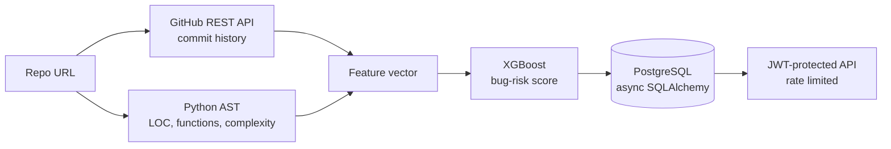

 

**Backend & ML systems. Focused on what ships.**
 
Python · FastAPI · Node.js · PostgreSQL · MongoDB · Docker · LLM integration

 

---

## Open to work

**SDE-1 · Backend Engineer · AI Engineer**

B.E. Computer Engineering · Universal College of Engineering, University of Mumbai · 2022 – 2026

I take a service from schema design to a live URL: async API, auth, tests, CI, container, deploy. Three projects below went all the way through that loop.

---

## By the numbers

---

## What I've shipped

| | Project | What it does | Stack |
|---|---|---|---|
| 1 | **[Silent Bug Predictor](https://github.com/SnehaPoojary20/Silent-Bug-Predictor)** · [live](https://silent-bug-predictor.vercel.app/) | Scores each Python file's bug risk from AST signals (LOC, function count, cyclomatic complexity) plus GitHub commit history, using an XGBoost classifier. | FastAPI, PostgreSQL, XGBoost, JWT, pytest, Docker, Render |
| 2 | **[Explain My Code](https://github.com/SnehaPoojary20/Explain-My-Code)** · [live](https://explain-my-code-two.vercel.app/) | Parses code with Python AST, then asks an LLM for function-level explanations. Falls back to an AST-only summary if the LLM call fails. | FastAPI, React, Gemini API, Pydantic v2, httpx |
| 3 | **[NibbleNote](https://github.com/SnehaPoojary20/NibbleNote)** · [live](https://nibble-note.vercel.app) | Restaurant and café review platform with weighted-relevance search, refresh-token auth and an LLM review summarizer. | MERN, JWT, MongoDB aggregation, Tailwind |
| 4 | **[Expert-call transcript analyzer](https://github.com/SnehaPoojary20/AI_Engineer_Case_Study)** | Answers an interview guide from call transcripts, pulls verbatim quotes with timestamps, finds themes and disagreements across calls. | Python, FastAPI, LLM |

### Decisions I'm proud of

- **Fail soft, not loud.** Explain My Code validates every LLM response against a strict Pydantic v2 schema, and on timeout, rate limit or bad key it still returns the AST-based summary.
- **Persist, don't recompute.** Silent Bug Predictor writes every analysis to PostgreSQL through async SQLAlchemy, so history is queryable instead of vanishing with the response.
- **Pay the write cost once.** NibbleNote stores `avgRating` and `totalReviews` on the restaurant document and recalculates them on each review write, so reads never need a join.
- **Test the ugly inputs.** 8 pytest cases cover syntax errors and nested or async functions, and they run on every push through GitHub Actions.

Request path of Silent Bug Predictor.

---

## Stack

---

## Writing

I explain backend and DSA ideas the way I wish someone had explained them to me. Latest posts (refreshed automatically):

<!--POSTS:START-->
- [Two Pointers Explained: The Proof Nobody Shows You](https://dsamadesimple.hashnode.dev/two-pointers-explained-the-proof-nobody-shows-you) · Aug 20, 2026 · 7 min read
- [Sliding Window Algorithm Explained Visually](https://dsamadesimple.hashnode.dev/sliding-window-algorithm) · May 26, 2026 · 4 min read
- [From Confused to Confident in DSA](https://dsamadesimple.hashnode.dev/from-confused-to-confident-in-dsa) · Mar 21, 2026 · 3 min read
- [How Python Manages Memory: Stack vs Heap Explained](https://pythonmemory.hashnode.dev/how-python-manages-memory-stack-vs-heap-explained) · Mar 20, 2026 · 4 min read
- [What Happens When You Run a Python File?](https://snehapoojary.hashnode.dev/what-happens-when-you-run-a-python-file) · Feb 16, 2026 · 2 min read
<!--POSTS:END-->

---

## Find me

[Portfolio](https://portfolio-iota-pearl-81.vercel.app/) · [LinkedIn](https://www.linkedin.com/in/snehapoojary/) · [LeetCode](https://leetcode.com/u/SnehaPoojary__/) · [HackerRank](https://www.hackerrank.com/profile/snehapoojary2004) · [Hashnode](https://hashnode.com/@snehapoojary) · [Email](mailto:snehapoojary2004@gmail.com)

Stats card and post list are rebuilt daily by a GitHub Action in this repo.

